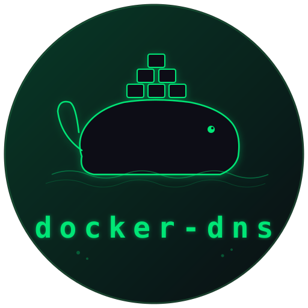

# Docker DNS Resolver

[](https://github.com/MedUnes/docker-dns/actions/workflows/test.yml) [](https://github.com/MedUnes/docker-dns/actions/workflows/release.yml) [](https://goreportcard.com/report/github.com/medunes/docker-dns) [](LICENSE) [](https://pkg.go.dev/github.com/medunes/docker-dns)



A lightweight DNS server that resolves Docker container names to their IP addresses, enabling seamless networking between containers and the host.

## Features

- **Automatic DNS Resolution**: Resolve Docker container names with a custom TLD to their respective IP addresses.
- **Caching Mechanism**: Configurable TTL for DNS cache entries to improve performance.
- **Simple Configuration**: Minimal setup with command-line options or a configuration file.
- **Debian Package**: Easy-to-install `.deb` package for seamless integration.
- **Fallback DNS**: Forwards non-Docker queries to configurable DNS servers.
- **Lightweight and Fast**: Built with Go for high performance.

## Installation for Linux/Debian:

### Download and Install the Debian Package

1. **Download the latest `.deb` Package**:
     ```
     wget https://raw.githubusercontent.com/MedUnes/docker-dns/master/install_debian_latest.sh | bash
     ```

2. **Install the Package**:
   ```bash
   sudo dpkg -i docker-dns-1.1.1_amd64.deb
   ```
### Configuration

1. **Check the Service Status**:
   - Ensure the service is running:
     ```bash
     systemctl status docker-dns
     ```

2. **Edit the Configuration (Optional)**:
   - The configuration file is located at `/etc/docker-dns/docker-dns.conf`.
   - Example:
     ```ini
     # Docker DNS Configuration
     IP=127.0.0.153
     TTL=300
     TLD=docker
     DEFAULT_RESOLVER=8.8.8.8,1.1.1.1,8.8.4.4
     ```
   - After making changes, restart the service:
     ```bash
     sudo systemctl restart docker-dns
     ```
3. **Restart the Service After Changes**:

* If you edit the configuration file, restart the service to apply changes:
    ```bash
    sudo systemctl restart docker-dns
    ```
---

## Usage

1. **Web Browser Access**
- The simplest way to use `docker-dns` and leverage its seamless developer experience is through the web browser.
- Let's suppose you have a dockerized Next.js application which container name is `my_dashboard` listening on port `3000`.
- Having `docker-dns` integrated to your OS (see below), you could simply launch your web browser and type in the address bar: http://my_dahsboard.docker:3000
- This will allow you to work with your web applications by adding the `.docker` (or any other configured TLD) to the container names without going through the burden of manual IP/Port manual setup.

2. **Resolve containers by their names**
- Assuming a container named `mycontainer` is running, and that `docker-dns` has been configured to listen on ip `127.0.0.153`, and the TLD is `.docker`, let's resolve the container's IP:
   ```bash
   dig mycontainer.docker @127.0.0.153 +short
   ```
3. **Resolve external domains**
- Check that `docker-dns` is also capable of resolving domains which are not "internal" docker container names
- Verify non-Docker queries are forwarded to the fallback DNS:
   ```bash
   dig google.com @127.0.0.153 +short
   ``` 
---

## Full Configuration Details
* It is possible to configure the `docker-dns` server at startup time through a couple of CLI arguments
* The `systemd` setup of the application uses an INI-style configuration file located at `/etc/docker-dns/docker-dns.conf`.
* Below is an explanation of the configurable options:

### `--ip` (INI file variable name: `IP`)
- The ip address the DNS server listens on (default: `127.0.0.153`).
- Typically, it would be within the loop-back range (```127.0.0.0/8```), but could also be an IP for a customer interface.
- Default: `127.0.0.153`
- Change this value if another service (e.g., a DNS server) is already using this IP, or if you target another interface.
- Example: if you don't have any DNS server already listening on the localhost IP (`127.0.0.1`), you can start `docker-dns` as such:
  - ```bash
    ./sudo docker-dns --ip=127.0.0.1
    ```

### `--ttl` (INI file variable name:  `TTL` )
- The time-to-live (in seconds) for cached DNS records (default: `300`).
- Use a higher value for less frequent updates (better performance)
- Use a lower value for more real-time accuracy.

### `--tld` (INI file variable name:  `TLD`)
- The top-level domain for resolving container names (default: `docker`).
- Example: if ```TLD=local``` and a container's name is ```mycontainer```, queries to ```mycontainer.local``` will resolve to the container's IP.

### `--default-resolver` (INI file variable name:  `DEFAULT_RESOLVER`)

- A comma-separated list of fallback DNS servers (default: `8.8.8.8,1.1.1.1,8.8.4.4`).
- These are used when a query cannot be resolved via Docker-based DNS.
- Examples:
  - ```8.8.8.8``` (Google DNS)
  - ```1.1.1.1``` (Cloudflare DNS)
  - ```127.0.0.1``` (Some Local DNS server)
- Notes:
  - Specify multiple servers to provide redundancy (e.g., ```DEFAULT_RESOLVER=8.8.8.8,1.1.1.1```).
  - To use a local DNS server for non-Docker queries, add its IP address here (e.g., ```127.0.0.1```).

---

## Build/Run from Source

### Download built/compiled binaries:
- Go to the [Releases](https://github.com/MedUnes/docker-dns/releases) page.
- Pick the package that matches your OS/Environment, download and run as explained below

### Build locally:

- For developers, you can build the application from source:

1. Clone the repository:
   ```bash
   git clone https://github.com/medunes/docker-dns.git
   cd docker-dns
   ```
2. Build the binary:
   ```bash
   make build
   ```

### Run the binary:

- Once you have the binary generated, you can run at as follows (linux):
   ```bash
   ./ sudo docker-dns -h
      Usage of bin/docker-dns:
   -ip string
      IP address on which the DNS server will listen (default "127.0.0.153")
   -tld string
      Top-level domain for container DNS resolution (default "docker")
   -ttl int
      Time-to-live for DNS cache entries in seconds (default 300)
   -default-resolver string
      Comma-separated list of fallback DNS resolvers (default "1.1.1.1,8.8.8.8,9.9.9.9")
   -help
      Display help and usage information
   ```
- P.S: `sudo` (or `root`) is required as the server will be  listening on port `53`, which is a [Privileged Port](https://www.w3.org/Daemon/User/Installation/PrivilegedPorts.html)
---

## Contributing

Contributions are welcome!

1. Fork the repository.
2. Create a feature branch:
   ```bash
   git checkout -b feature/YourFeature
   ```
3. Commit your changes:
   ```bash
   git commit -am 'Add YourFeature'
   ```
4. Push to the branch:
   ```bash
   git push origin feature/YourFeature
   ```
5. Open a Pull Request.

---

## License

This project is licensed under the AGPL License - see the [LICENSE](./LICENSE) file for details.

---

*Empower your Docker networking with easy-to-use DNS resolution!*
