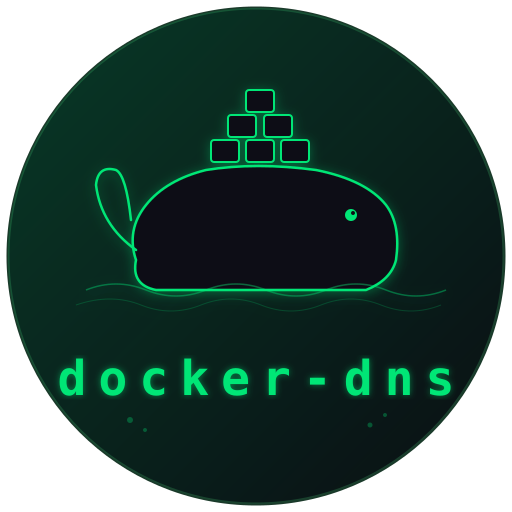
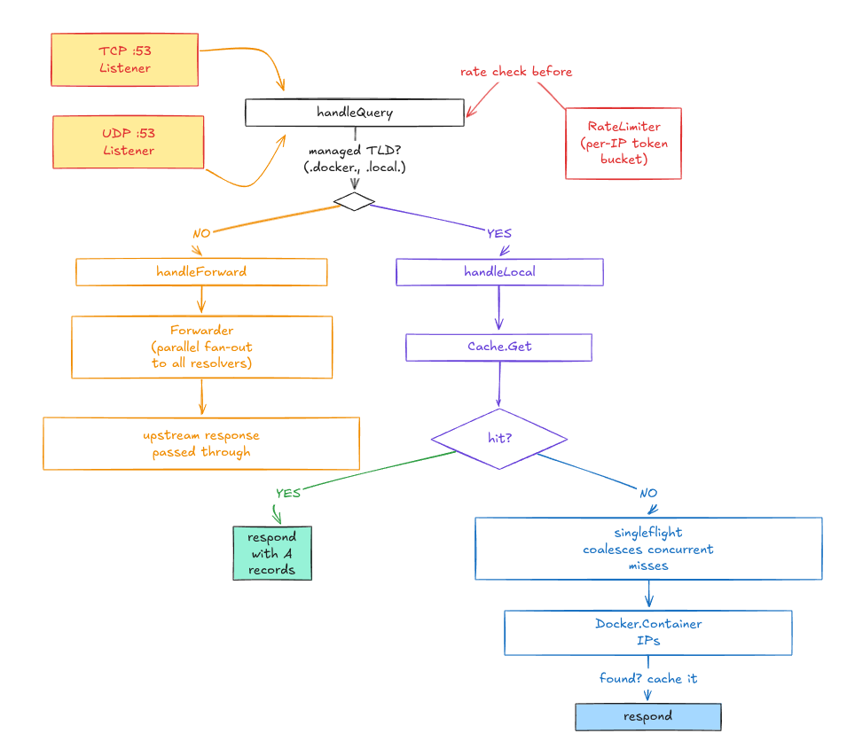

<h1 align="center">
Docker DNS
    <br>
    
</h1>

[](https://github.com/MedUnes/docker-dns/actions/workflows/test.yml) [](https://github.com/MedUnes/docker-dns/actions/workflows/release.yml) [](https://goreportcard.com/report/github.com/medunes/docker-dns) [](LICENSE) [](https://pkg.go.dev/github.com/medunes/docker-dns)

A lightweight DNS server that resolves Docker container names to their IP addresses, enabling seamless networking
between containers and the host.

## Features

- **Automatic DNS Resolution**: Resolve Docker container names with a custom TLD to their respective IP addresses.
- **Caching Mechanism**: Configurable TTL for DNS cache entries to improve performance.
- **Simple Configuration**: Minimal setup with command-line options or a configuration file.
- **Debian Package**: Easy-to-install `.deb` package for seamless integration.
- **Fallback DNS**: Forwards non-Docker queries to configurable DNS servers.
- **Lightweight and Fast**: Built with Go for high performance.

## Architecture

The diagram below shows how a DNS query flows through the system, from the network listeners down to Docker or upstream
resolvers.


Queries for managed TLDs (like `.docker` or `.local`) are resolved by inspecting the matching Docker container. A
singleflight gate prevents concurrent cache misses for the same name from hammering the Docker API. All other queries
are forwarded in parallel to the configured upstream resolvers, returning the first successful response.

## Installation for Linux/Debian:

**Important**: Please read [this documentation](./docs/Systemd.md) carefully to have a deep overview on how systemd
integrates with DNS resolution for each ditro/version..

### Download and Install the Debian Package

1. **Download the `.deb` Package**:
    - Go to the [Releases](https://github.com/MedUnes/docker-dns/releases) page.
    - Find the release matching your desired version (e.g., `v1.0.2`).
    - Download the `.deb` file:
      ```
      wget https://github.com/MedUnes/docker-dns/releases/download/v1.0.2/docker-dns-1.0.2_amd64.deb
      ```

2. **Install the Package**:
   ```bash
   sudo dpkg -i docker-dns-1.0.2_amd64.deb
   ```

### Configuration

1. **Check the Service Status**:
    - Ensure the service is running:
      ```bash
      systemctl status docker-dns
      ```

2. **Edit the Configuration (Optional)**:
    - The configuration file is located at `/etc/docker-dns/docker-dns.conf`.
    - Example:
      ```ini
      # Docker DNS Configuration
      IP=127.0.0.153
      TTL=300
      TLD=docker,local
      DEFAULT_RESOLVER=8.8.8.8,1.1.1.1,8.8.4.4
      ```
    - After making changes, restart the service:
      ```bash
      sudo systemctl restart docker-dns
      ```
3. **Restart the Service After Changes**:

* If you edit the configuration file, restart the service to apply changes:
    ```bash
    sudo systemctl restart docker-dns
    ```

---

## Usage

1. **Resolve containers by their names**

- Assuming a container named `mycontainer` is running, and that `docker-dns` has been configured to listen on ip
  `127.0.0.153`, and the TLD is `.docker`, let's resolve the container's IP:
   ```bash
   dig mycontainer.docker @127.0.0.153 +short
   ```

2. **Resolve external domains**

- Check that `docker-dns` is also capable of resolving domains which are not "internal" docker container names
- Verify non-Docker queries are forwarded to the fallback DNS:
   ```bash
   dig google.com @127.0.0.153 +short
   ``` 

---

## Full Configuration Details

* It is possible to configure the `docker-dns` server at startup time through a couple of CLI arguments
* The `systemd` setup of the application uses an INI-style configuration file located at
  `/etc/docker-dns/docker-dns.conf`.
* Below is an explanation of the configurable options:

### `--ip` (INI file variable name: `IP`)

- The ip address the DNS server listens on (default: `127.0.0.153`).
- Typically, it would be within the loop-back range (```127.0.0.0/8```), but could also be an IP for a customer
  interface.
- Default: `127.0.0.153`
- Change this value if another service (e.g., a DNS server) is already using this IP, or if you target another
  interface.
- Example: if you don't have any DNS server already listening on the localhost IP (`127.0.0.1`), you can start
  `docker-dns` as such:
    - ```bash
    ./sudo docker-dns --ip=127.0.0.1
    ```

### `--ttl` (INI file variable name:  `TTL` )

- The time-to-live (in seconds) for cached DNS records (default: `300`).
- Use a higher value for less frequent updates (better performance)
- Use a lower value for more real-time accuracy.

### `--tld` (INI file variable name:  `TLD`)

- A comma-separated list of top-level domains for resolving container names (default: `docker`).
- Example: if ```TLD=docker,local``` and a container's name is ```mycontainer```, queries to both
  ```mycontainer.docker``` and ```mycontainer.local``` will resolve to the container's IP.

### `--resolvers` (INI file variable name:  `DEFAULT_RESOLVER`)

- A comma-separated list of fallback DNS servers (default: `8.8.8.8,1.1.1.1,8.8.4.4`).
- These are used when a query cannot be resolved via Docker-based DNS.
- Examples:
    - ```8.8.8.8``` (Google DNS)
    - ```1.1.1.1``` (Cloudflare DNS)
    - ```127.0.0.1``` (Some Local DNS server)
- Notes:
    - Specify multiple servers to provide redundancy (e.g., ```DEFAULT_RESOLVER=8.8.8.8,1.1.1.1```).
    - To use a local DNS server for non-Docker queries, add its IP address here (e.g., ```127.0.0.1```).

---

## Important Notes

### Default Resolver Integration

- While Docker DNS runs by default on a custom IP (not `127.0.0.1`), it is possible to use tools like `dig` to test
  queries:
  ```bash
       dig mycontainer.docker @127.0.0.153 +short 
  ```
    - However, making Docker DNS the system-wide default resolver requires additional configuration or hacks.

### Systemd-Resolved Compatibility: Direct integration with
`systemd-resolved` is non-trivial and not recommended without advanced setup.

### Protocol

* `docker-dns` is configured to run on `UDP` mode only, so `TCP` requests won't be answered

---

## Build/Run from Source

### Download built/compiled binaries:

- Go to the [Releases](https://github.com/MedUnes/docker-dns/releases) page.
- Pick the package that matches your OS/Environment, download and run as explained below

### Build locally:

- For developers, you can build the application from source:

1. Clone the repository:
   ```bash
   git clone https://github.com/medunes/docker-dns.git
   cd docker-dns
   ```
2. Build the binary:
   ```bash
   make build
   ```

### Run the binary:

- Once you have the binary generated, you can run at as follows (linux):
   ```bash
   sudo ./docker-dns -h
      Usage of docker-dns:
   -ip string
      IP address the DNS server listens on (default "127.0.0.153")
   -tld string
      Comma-separated managed top-level domains for container resolution (default "docker")
   -ttl int
      TTL in seconds for cache entries and DNS responses (default 300)
   -resolvers string
      Comma-separated fallback DNS resolver IPs (default "8.8.8.8,1.1.1.1,8.8.4.4")
   -forward-timeout duration
      Per-resolver timeout for forwarded DNS queries (default 2s)
   ```
- P.S: `sudo` (or `root`) is required as the server will be listening on port `53`, which is
  a [previewed port](https://www.w3.org/Daemon/User/Installation/PrivilegedPorts.html)

---

## Contributing

Contributions are welcome!

1. Fork the repository.
2. Create a feature branch:
   ```bash
   git checkout -b feature/YourFeature
   ```
3. Commit your changes:
   ```bash
   git commit -am 'Add YourFeature'
   ```
4. Push to the branch:
   ```bash
   git push origin feature/YourFeature
   ```
5. Open a Pull Request.

---

## License

This project is licensed under the AGPL License - see the [LICENSE](./LICENSE) file for details.

---

*Empower your Docker networking with easy-to-use DNS resolution!*
